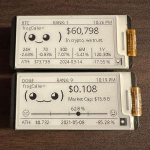
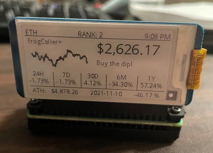

# cryptogotchi

<div style="display: flex; gap: 10px;"> 
    
    
</div>
A playful twist on Pwnagotchi! Cryptogotchi fetches live cryptocurrency prices and displays them on a 2.13-inch e-ink display. Track your favorite coins like Bitcoin, Dogecoin, and more!

Data provided by [CoinGecko](https://www.coingecko.com/en/api)


# Materials
* [Raspberry pi Zero 2 WH](https://amzn.to/3VO7eu2)<br />
* [Micro SD Cards](https://amzn.to/4erXgWD)<br />
* [2.13inch e-ink](https://amzn.to/3WLFCX2)<br />
* [UPS Hat](https://amzn.to/4ceZp6I)<br />

<br />
(Amazon affiliate links)<br />

## **Installations**

1. **OS install:**
   - Install Raspberry Pi OS Lite (64-bit) on your Raspberry Pi <br />

2. **Enable SPI & I2C:**
   - Open a terminal on your Raspberry Pi.
   - Run `sudo raspi-config`
   - Navigate to Interfacing Options -> SPI -> Enable.
   - Navigate to Interfacing Options -> I2C -> Enable.

3. Clone the repository:
   ```bash
   sudo apt install -y git
   git clone https://github.com/frogCaller/cryptogotchi.git
   cd cryptogotchi

# Wiring and Setup
1. **Connect 2.13inch e-Ink HAT to Raspberry Pi:**
   - Connect the 2.13inch e-Ink HAT to your Raspberry Pi. <br />
   - Connect the UPS Hat for continuous power supply. This will allow you to move the project anywhere without worrying about power interruptions.

2. **Install System and Python Dependencies:**
   ```bash
   chmod +x setup.sh
   ./setup.sh
# Usage Instructions  
1. Run the script:
   ```
   python3 cryptogotchi.py
   ```


# Troubleshooting
Common Issues:
   - Ensure SPI & I2C are enabled in the Raspberry Pi configuration.
   - Check all connections if the screen does not display anything.
   - Verify all required packages are installed correctly.
   - [More Info](https://www.waveshare.com/wiki/2.13inch_e-Paper_HAT_Manual)
